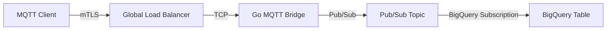

# Cloud MQTT Node

> **Disclaimer**: This is not an officially supported Google product.

> A highly scalable, secure MQTT bridge to Google Cloud BigQuery via Pub/Sub, deployed on Compute Engine.

## Architecture



## Features
-   **High Performance**: Custom Go bridge using `paho.mqtt` and Google Cloud Pub/Sub client libraries.
-   **Scalable**: Deployed behind a Global External TCP Load Balancer with NEGs (Network Endpoint Groups).
-   **Security**: Enforced mTLS authentication (Client Certificates) at the Load Balancer level.
-   **Serverless Data Ingestion**: Direct streaming from Pub/Sub to BigQuery.


> **Note on Enterprise Alternatives**: There are excellent commercial platforms available on the market (such as [Litmus](https://litmus.io/), [Clearblade](https://www.clearblade.com/), and others) that provide comprehensive, fully-managed IoT messaging capabilities. This project is not intended to replace them, but rather to offer a quick, easily deployable foundation for a Proof of Concept (POC) or a lightweight custom pipeline on GCP.
> 
> *It is important to note that this architecture focuses purely on raw message ingestion. It lacks key enterprise features provided by these platforms, such as:*
> - *Detailed Device Management (Twin state, lifecycles, and provisioning).*
> - *Over The Air (OTA) firmware updates.*
> - *Edge protocol translation (OPC UA, Modbus, Profinet to MQTT).*
> - *Advanced edge computing (running ML models or local analytics before sending data to the cloud).*

This architecture is built around an in-memory Mosquitto broker handling the client connections before forwarding messages to Pub/Sub. Because Mosquitto operates in-memory and does not share session state across nodes, the Managed Instance Group (MIG) is intentionally **fixed to 1 instance**. 

>  **Single Point of Failure (SPOF) & Data Loss Warning**: Because the architecture relies on a single VM, it inherently presents a SPOF. We have intentionally chosen a **Stateless** Managed Instance Group (MIG) to maximize deployment simplicity (e.g. via the `install.sh` script) and minimize operational overhead (avoiding complex regional persistent disk mounts and startup scripts). 
> 
> * **What this means for data**: If the Mosquitto container crashes or the VM reboots gracefully, *no data is lost* because the queue is saved to the local boot disk. However, if the VM dies completely (e.g., hard crash, zone failure) and the MIG spins up a brand-new instance to replace it, the old boot disk is destroyed and any messages queued in Mosquitto at that split second **will be permanently lost**. 
> 
> * **The trade-off**: This Stateless architecture is a deliberate compromise—accepting a minimal risk of message loss during rare critical failures in exchange for a simple, "1-click" serverless-like deployment model.

Even with a single instance, an `e2-medium` VM running this lightweight Go bridge is capable of handling peak loads of up to **10,000 to 15,000 messages per second**.

To put that into an industrial context:

| Facility Type | Avg. Sensors | Message Frequency | Total Messages / Second | Notes |
| :--- | :--- | :--- | :--- | :--- |
| **Small Workshop (CNC Machining)** | 50 - 200 | 1 msg / 5s | 10 - 40 msg/s | Basic machine state monitoring (on/off, faults). |
| **Connected Logistics Warehouse** | 2,000 - 5,000 | 1 msg / 10s | 200 - 500 msg/s | Tracking AGVs (robots), RFID tags, and dock doors. |
| **Refinery / Chemical Plant** | 10,000 - 50,000 | 1 msg / 10s | 1,000 - 5,000 msg/s | Many control points (valves, pressure), but processes evolve slowly. |
| **Ultra-High-Speed Bottling Line** | 300 - 800 | 10 msg / 1s | 3,000 - 8,000 msg/s | Fewer sensors, but extreme pace requiring near real-time tracking (vision, rejects). |
| **Offshore Wind Farm** | 5,000 - 10,000 | 5 msg / 1s | 25,000 - 50,000 msg/s | Very high frequency to monitor blade and turbine vibrations (often sent in data batches). |

From an industrial perspective, these figures represent excellent baseline averages for centralized telemetry data ingestion. However, the reality is often asymmetrical: an ambient temperature sensor might only send one message per minute, while a vibration sensor for predictive maintenance could sample at 10,000 Hz (although it is often pre-processed at the edge/Edge computing so it only sends a summary once per second). Even with these variations, a massive facility fits comfortably within the theoretical limits of this single, tiny node.

> **The Reality of Edge Computing**: To avoid saturating the network with the 30,000+ messages per second of a "Mega-Factory", industrial environments heavily rely on Edge Computing. Local gateways or PLCs aggregate, filter, and process data at the edge, sending only anomalies, averages, or state changes (management by exception) to the cloud. This project intentionally **does not** handle edge computing or protocol translation, focusing purely on high-throughput cloud ingestion from capable edge gateways. 
> 
> *It's also worth noting that this architecture is possible because **BigQuery** is inherently designed to ingest massive volumes of streaming data. Pub/Sub writes directly to it at an almost unbounded scale without any traditional database bottlenecks.*


###  Assumptions

This project focuses strictly on the cloud-side ingestion architecture. **It does not cover the physical devices, sensors, or edge gateways.** The architecture operates on the fundamental assumption that you already have devices or edge systems capable of successfully connecting and sending data via the MQTT protocol.


### Scalability limits & tuning

This project uses a scale-upvertical approach rather than a complex distributed cluster. With the default `e2-medium` (2 vCPUs, 4GB RAM) configuration, the theoretical physical limits are:

- **Maximum Connections**: ~65,000 concurrent devices (limited by the OS `ulimit -n` configuration on the VM).
- **Maximum Throughput**: ~10,000 - 15,000 messages per second (bottlenecked by the 2 vCPUs processing MQTT packets and encrypting gRPC traffic to Pub/Sub).

To unlock this massive throughput on a single node, the following specific optimizations are baked into the architecture:
- **Mosquitto Queue Bypass**: In the startup script, Mosquitto is explicitly configured with `max_queued_messages 0` and `max_inflight_messages 65535` so it never artificially drops messages or blocks the Go bridge subscriber. *Note: `65535` is explicitly chosen because it is the hard mathematical limit of the 16-bit Packet ID in the MQTT protocol for QoS 1 & 2. Bounding it to this absolute native limit instead of `0` (unlimited) prevents the broker CPU from entering unbounded loops or memory crashes during extreme load spikes, while still guaranteeing the maximum theoretical throughput the protocol allows.*
- **Go Bridge Pub/Sub Batching**: The `bridge/main.go` uses aggressively tuned Pub/Sub producer settings (5MB payload thresholds, 1000 message batches, and 10 concurrent goroutines) to maximize outbound bandwidth to Google Cloud.
- **High-Concurrency OS Tuning**: The VM startup script increases system-wide file descriptors (`fs.file-max`) and TCP backlog queues to ensure network saturation does not fail at the OS layer.

*Note: For extreme environments requiring even more throughput (e.g. 50,000+ msgs/s), you can scale the instance up to an `e2-standard-4` or `c2-standard-4` (compute-optimized). The architecture scales vertically flawlessly, though this will proportionately increase monthly compute costs.*


### Cost Estimation
This solution is designed to be highly cost-effective, leveraging serverless scale-to-zero concepts where possible (Pub/Sub and BigQuery) while maintaining a persistent edge:
* **Compute**: A default `e2-medium` costs approximately ~$25/month.
* **Network & Load Balancing**: The Global TCP Load Balancer incurs a base forwarding rule cost of ~$18/month plus data processing fees.
* **Data Transit (Pub/Sub & BQ)**: Billed per GB processed. At standard POC scales, this amounts to pennies.
* **Total Estimated Cost**: Roughly **$45 - $55 per month** for the entire highly-available ingestion pipeline, capable of handling massive industrial volumes.

## Prerequisites

1.  **Google Cloud Project**: You need an active GCP project with billing enabled.
2.  **gcloud CLI**: Installed and authenticated (`gcloud auth login`, `gcloud config set project YOUR_PROJECT_ID`).
3.  **Terraform**: Installed (>= 1.5.0).
4.  **Docker**: Installed and running (for local builds/testing).

## Quick Start

### 1. Initialize & Deploy

You have two options to deploy this architecture:

**Option 1: Quick Install (Recommended)**
Use the automated installation script. It will check prerequisites, clone the repository, and guide you through configuration before launching the deployment.

```bash
curl -sO https://raw.githubusercontent.com/lvaracca/cloud-mqtt-node/main/install.sh
bash install.sh
```

**Option 2: Manual Clone**
If you prefer to review the code first, you can clone the repository and run the `init` script manually. The `init` script handles everything: API enablement, IAM configuration, Docker build/push, and Terraform deployment.

```bash
git clone https://github.com/lvaracca/cloud-mqtt-node.git
cd cloud-mqtt-node
export GCP_PROJECT_ID="your-project-id"
chmod +x ./init
./init
```

### 2. Certificates (Important!)

This project uses **mTLS**. You must provide:
-   `ca_cert_pem`: The CA certificate that signed the client certs.
-   `tls_cert`: The server certificate for the Load Balancer.
-   `tls_key`: The private key for the server certificate.
-   `domain_name`: The domain name matching the server certificate.

**For Testing**:
If `terraform/terraform.tfvars` is missing, the `init` script will ask if you want to generate self-signed certificates automatically.
You can also force this manually:

```bash
./generate_certs.sh "mqtt.example.com"
```

This will create valid self-signed certs in `certs/` and populate `terraform/terraform.tfvars`.

**Using Your Own Certificates**:

If you have valid certificates (e.g., from Let's Encrypt or your internal CA), place them in the `certs/` directory with these exact names before running `./init`:

-   `certs/ca.pem` (CA Certificate)
-   `certs/server.crt` (Server Certificate)
-   `certs/server.key` (Server Private Key)

Alternatively, you can manually create `terraform/terraform.tfvars` with the content of these files.

### 3. Cleanup

To tear down the infrastructure:

```bash
cd terraform
terraform destroy
```

## Documentation

-   [Architecture Details](docs/architecture.md)
-   [Maintenance & Troubleshooting](docs/maintenance.md)

## Support & Feedback

This project is a Proof of Concept and is not an officially supported Google product. I do not commit to providing active maintenance or long-term support, but I will do my best to address issues and review pull requests as time allows.

I am very interested in hearing your feedback! If you deploy this architecture, run into bottlenecks, or have ideas for improvements, please open an issue or start a discussion in the repository.

## License

This project is licensed under the **Apache License 2.0**. 

You are completely free to use, modify, and distribute this software as you see fit, whether for personal, academic, or commercial purposes. The goal is to give you a strong foundation to build upon.
